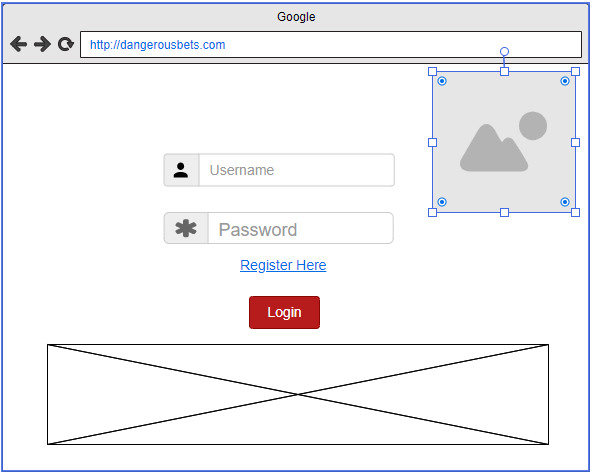
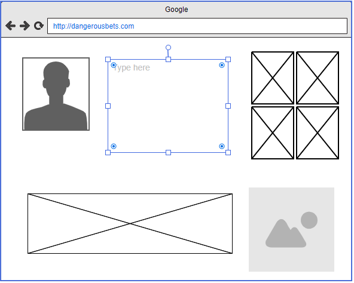
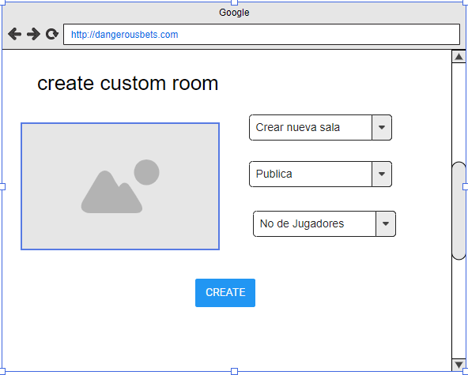
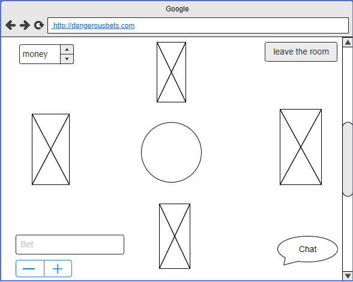
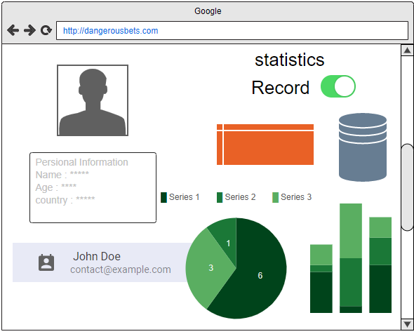
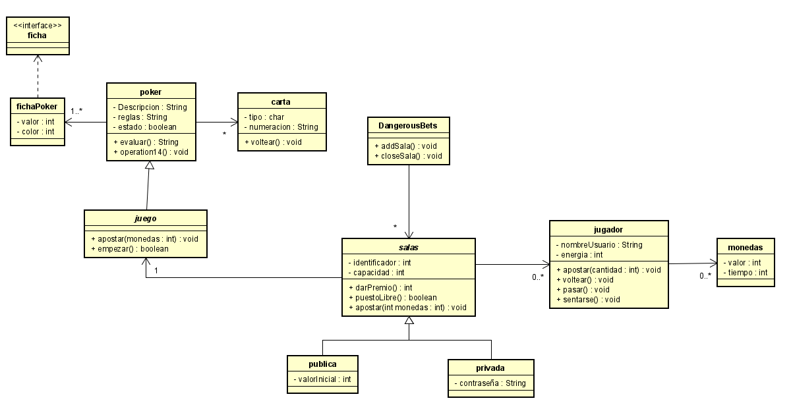

# DangerousBets-ARSW

[Taiga](https://tree.taiga.io/project/julitom1-dangerousbets-1/backlog)

### Circleci

### Despliegue Heroku

 ## Integrantes
  * Miguel Angel Fuquene
  * Juan Sebastian Ramos
  * Yarit Yajanny Villalobos

 
 ## Descripción
 
 En este proyecto se desarrollara un plataforma de apuestas(POKER) online en la que los usuarios podrán interactuar entre ellos, los usuarios podran realizar apuestas, unirse a salas y jugar. Está plataforma evita que las personas se reúnan, en estos tiempos de cuarentena, y ayuda que nuestros usuarios se entretengan y puedan pasar el tiempo, sin incumplir esta norma. Para evitar que nuestros usuarios se vuelvan adictos a las apuestas se implementara un sistema de energía para que tengan un limite de juegos y no pierdan todo el día.
 
## Resumen

La idea del proyecto es hacer una plataforma donde la gente se pueda conectar concurrentemente y tiempo real a dicha plataforma.Esta tratara de un juego poker donde las personas podran hacer sus apuestas y poder pasarla bien en estos tiempos de pandemia. Inicialmente queremos que el usuario se registre con un correo electronico y despues de eso les daremos inicialmente 5000 monedas del juego para que puedan empezar sus apuestas, cada dia el usuario al ingresar podra adquirir 1000 monedas mas a su cuenta, esto para cuando las personas se queden sin monedas para jugar, tambien tendra como tal un chat para que puedan dialogar entre ellos. Los usuarios dispontran de dos opciones a la hora de jugar, entrar a una sala publica o crear una sala privada para poder jugar con conocidos en dado caso, en las salas publicas lo ideal es que se pueda entrar en cualquier momento y en dado caso que una ronda ya haya empezado este podra espectar a los que ya estan jugando y una vez terminada la ronda, este podra entrar a jugar.

## ¿Qué necesidad resuelve?
Esta plataforma ayudara a personas de todas las edades a tener un medio por el cual entretenerse sin necesidad de exponerse en estos tiempos de pandemia, ademas de poder jugar con personas a distancias largas.

## Requerimientos funcionales:
 -	Chat entre jugadores dentro de las salas.
 -	Registro y login de usuarios en la plataforma
 -	Juego de póker
 -	Creación de salas privadas
 -	Actualización del dinero dentro del juego
 -	Ranking de mejores jugadores
 -	Categorización de salas
 -	Lista de amigos por usuario
 -	Control de pagos

 ## Casos de Uso:
 
 
 
## Mockups

- Login y registro

- Menu principal

- Personalizacion de juego

- Sala de juego

- Datos y estadisticas

## Diagrama de Clases

## Diagrama c&c

## Diagrama de despliegue

## Diagrama entidad-Relación

 
